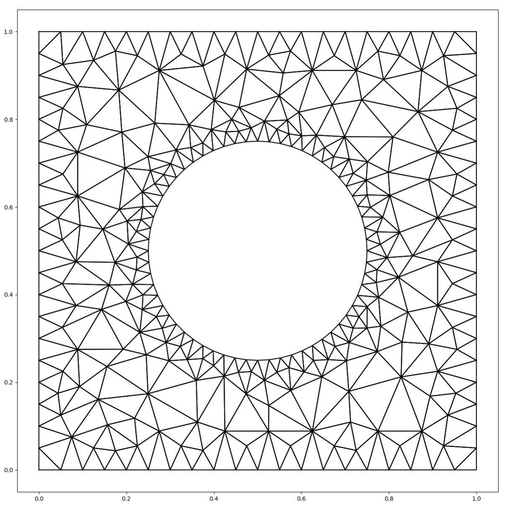
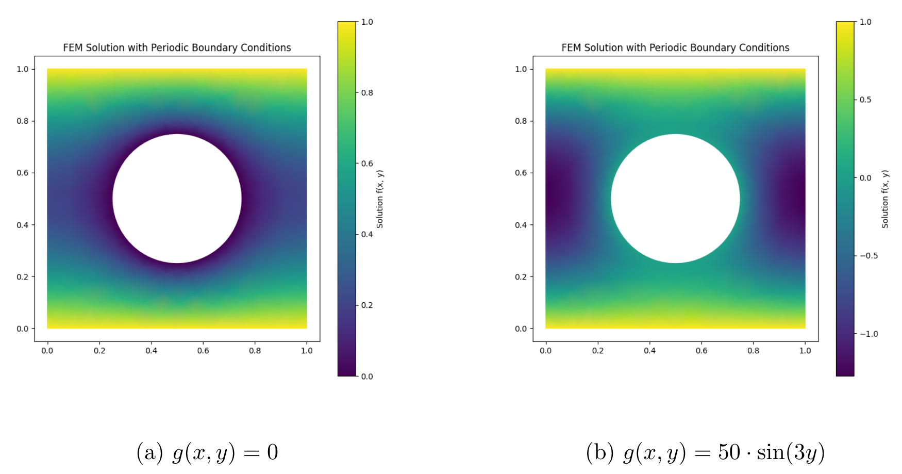
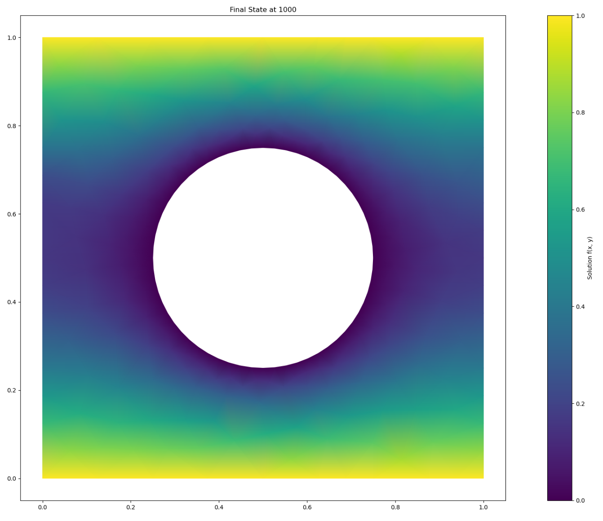
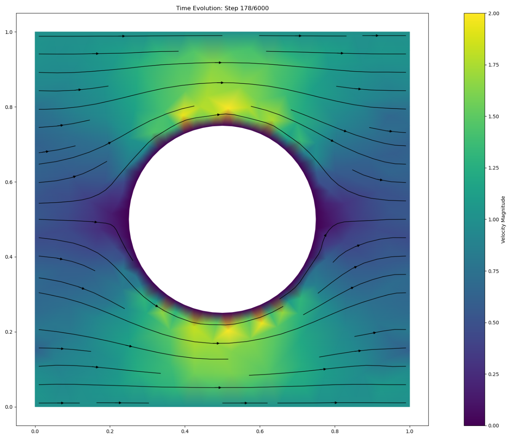

# PUC Fluid Simulation Project  

## Overview  
This project implements a **2D Stokes solver** from the ground up, without relying on pre-existing simulation libraries such as FEniCSx. The domain is discretized using triangular meshes generated with *Triangle*, with a circular squirmer placed at the center.  

The project serves two purposes:  
1. **Developing a stable fluid solver** for Stokes flow using finite element methods (FEM).  
2. **Investigating squirmer boundary conditions** to determine how swimming strategies affect mixing and food capture efficiency.  

## Workflow  
The development followed a bottom-up approach, starting with simpler PDEs and building towards the Stokes solver:  
1. **Triangle mesh generation** of a 2D domain with a central squirmer.  
2. **Poisson solver** via FEM for pressure projection.  
3. **Heat equation solver** for time-dependent diffusion.  
4. **Stokes solver** using operator splitting (velocity update → pressure correction → projection).  

## Results  
- A functioning **Poisson and heat equation solver** was implemented successfully.  
- A **2D Stokes solver** was developed and stabilized via mass-lumped FEM, though non-zero divergence and checkerboarding effects limited accuracy.  
- Despite instabilities, the solver enabled **visualization of squirmer-driven flows**, tracer advection, and mixing dynamics.  
- Simulations with different squirmer models (neutral, pusher, puller) showed that **pusher/puller strategies enhance mixing and food capture**, whereas the neutral swimmer is less effective.  

---

## Triangle Mesh  

## Poisson's Equation Solver  

## Heat Equation Solver  
  
### Demo Video  

## Stokes Equation Solver  
  

## Visualization  
Color mixing and tracer-based food capture were simulated under different squirmer boundary conditions:  

- **Neutral swimmer (B1 = -2, B2 = 0):** Inefficient stirring, ~50% food consumed.  
- **Pusher swimmer (B1 = -2, B2 = -5):** Stronger stirring, ~97% food consumed.  
- **Puller swimmer (B1 = -2, B2 = 5):** Slightly more efficient than pusher, ~98% food consumed.  

### Videos  
  
  
  

---

